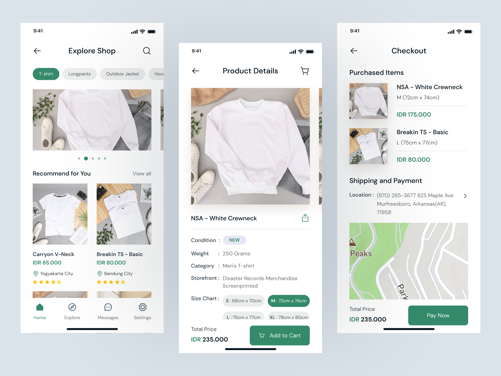

# Peak Tshirt Web App

> On vend des tshirts et on le fait bien.

## Getting Started

Create the `/public/config.json` file:

```json
{
  "API_BASE_URL": "http://localhost:3001"
}
```

It should be a `REACT_APP_API_BASE_URL` env var to host it on Netlify.

Install dependencies:

```shell
yarn
```

Run the dev server and the local API:

```shell
yarn start:api
yarn start
```

Make your move, develop your new feature, then commit with:

```shell
yarn commit
```

## Mockup



## Design System

Le Design System (DS) sera mis en place à travers l'approche [Atomic Design](https://atomicdesign.bradfrost.com/table-of-contents/) depuis le _folder_ `/src/ds/`.

## Alias modules ESM

Il existe 3 différents aliases utilisés dans ce repository et déclarés dans [jsconfig.json](./jsconfig.json) :

```json
"core": ["./src/core"],
"ds": ["./src/ds"],
"testUtils": ["./src/testUtils"]
```

Désormais, l'import d'un module se fera à travers :

```javascript
import { Price } from "ds/atoms";
```

⚠ _Warning_ : ne pas créer trop d'alias ! Cela rendrait les imports bien moins pertinents et la folder structure en souffrirait.

## CRA

[Official CRA doc](./docs/CRA.md).

## Todo

- [ ] CORS
- [x] Design de la TshirtPage
- [x] Data Dynamic de TshirtPage
- [x] Bouton ajout au panier (static)
